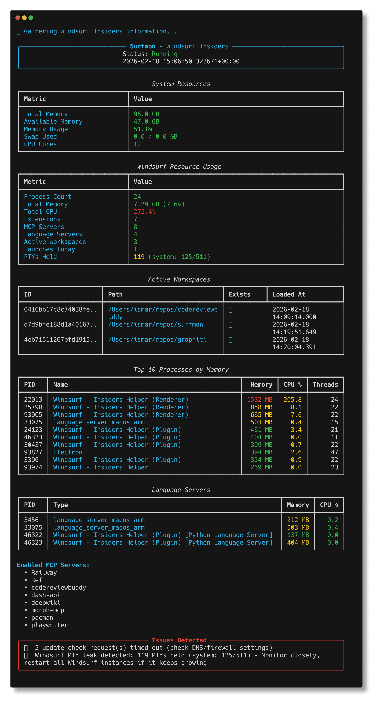
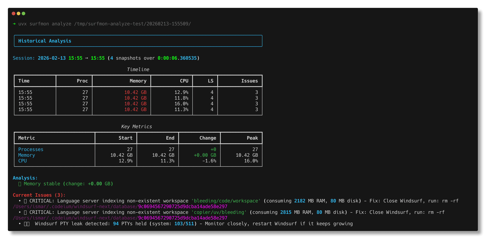
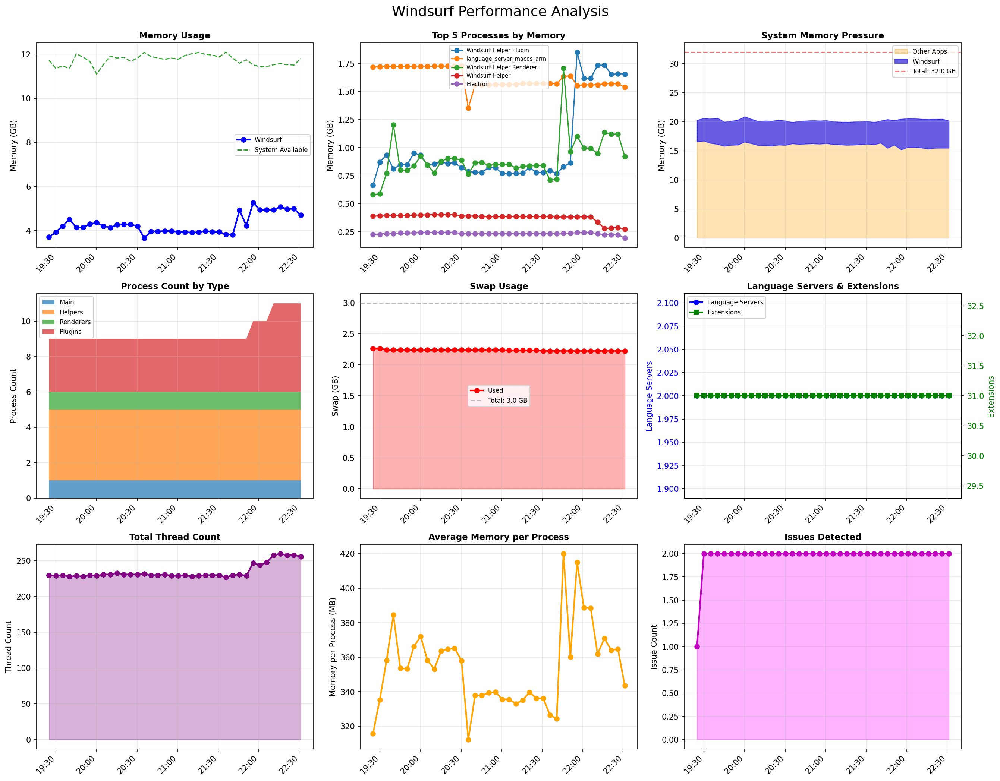
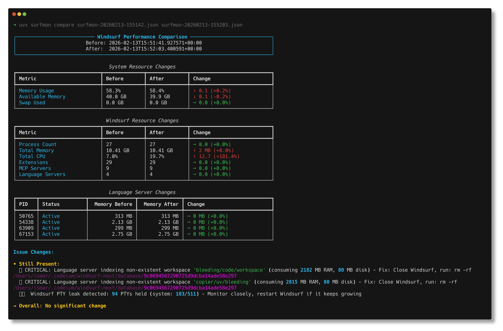

# Surfmon

<p align="center">
  
</p>

[](https://github.com/detailobsessed/surfmon/actions?query=workflow%3Aci)
[](https://github.com/detailobsessed/surfmon/actions?query=workflow%3Arelease)
[](https://detailobsessed.github.io/surfmon/)
[](https://pypi.org/project/surfmon/)
[](https://www.python.org/downloads/)
[](https://github.com/detailobsessed/surfmon/actions?query=workflow%3Aci)

**Surf**ace **Mon**itor for Windsurf IDE — a performance monitoring and diagnostics tool for [Windsurf](https://codeium.com/windsurf) (Stable, Next, and Insiders).

## Table of Contents

- [Installation](#installation)
- [Quick Start](#quick-start)
- [Why Use Surfmon?](#why-use-surfmon)
- [Commands](#commands)
  - [check — Quick Performance Snapshot](#check--quick-performance-snapshot)
  - [watch — Live Monitoring Dashboard](#watch--live-monitoring-dashboard)
  - [analyze — Historical Trend Analysis](#analyze--historical-trend-analysis)
  - [compare — Before/After Diff](#compare--beforeafter-diff)
  - [cleanup — Remove Orphaned Processes](#cleanup--remove-orphaned-processes)
  - [prune — Deduplicate Watch Reports](#prune--deduplicate-watch-reports)
- [What It Monitors](#what-it-monitors)
- [Target Selection](#target-selection)
- [Exit Codes](#exit-codes)
- [Common Issues](#common-issues)
- [Development](#development)
  - [Package Structure](#package-structure)
  - [Running Tests](#running-tests)
  - [Dependencies](#dependencies)
  - [Requirements](#requirements)
  - [Creating Screenshots](#creating-screenshots)

## Installation

```bash
pip install surfmon
```

Or with [uv](https://docs.astral.sh/uv/):

```bash
uv tool install surfmon
```

Or run directly without installing:

```bash
uvx surfmon check -t stable    # Using uvx
pipx run surfmon check -t stable    # Using pipx
```

For development:

```bash
git clone https://github.com/detailobsessed/surfmon.git
cd surfmon
uv sync
```

## Quick Start

```bash
# One-shot health check (--target is required)
surfmon check -t stable

# Verbose output with all process details
surfmon check -t stable -v

# Save reports (auto-named with timestamp, enables verbose output)
surfmon check -t next -s

# Target Windsurf Insiders
surfmon check -t insiders
```



## Why Use Surfmon?

- 🔍 **Debug Performance Issues** — Identify memory leaks, CPU spikes, and resource bottlenecks
- 📊 **Monitor Over Time** — Track resource usage trends with watch sessions and historical analysis
- 🧹 **Clean Up Resources** — Remove orphaned processes and duplicate reports
- 🔧 **Troubleshoot Crashes** — Detect extension host crashes, language server issues, and PTY leaks
- 📈 **Visualize Trends** — Generate matplotlib plots showing resource usage over time

## Commands

### `check` — Quick Performance Snapshot

The main command. Shows system resources, Windsurf memory/CPU, active workspaces, top processes, and language servers in consistent fixed-width tables.

```bash
surfmon check -t stable                        # Basic check
surfmon check -t stable -v                     # Verbose (all processes)
surfmon check -t next -s                       # Auto-save JSON + Markdown reports (enables verbose)
surfmon check -t stable --json report.json     # Save JSON to specific path
surfmon check -t stable --md report.md         # Save Markdown to specific path
surfmon check -t stable --json r.json --md r.md  # Save both formats with custom names
```

### `watch` — Live Monitoring Dashboard

Continuously monitors Windsurf with a live-updating terminal dashboard. Saves periodic JSON snapshots for historical analysis.

```bash
surfmon watch -t stable                    # Default: 5s interval, save every 5min
surfmon watch -t next -i 10 -s 600         # Check every 10s, save every 10min
surfmon watch -t insiders -i 10 -n 720     # 720 checks = 2 hours
surfmon watch -t stable -o ~/reports       # Custom output directory
```


### `analyze` — Historical Trend Analysis

Analyzes JSON reports from `watch` sessions (or any directory containing JSON reports) to detect memory leaks, process growth, and performance degradation. Optionally generates a 9-panel matplotlib visualization.

```bash
surfmon analyze reports/watch/20260204-134518/
surfmon analyze reports/watch/20260204-134518/ --plot
surfmon analyze reports/watch/20260204-134518/ --plot --output analysis.png
```

**Terminal Output:**



**Generated Matplotlib Visualization:**



### `compare` — Before/After Diff

```bash
surfmon check -t stable --json before.json
# ... make changes ...
surfmon check -t stable --json after.json
surfmon compare before.json after.json
```



### `cleanup` — Remove Orphaned Processes

Detects and kills orphaned `chrome_crashpad_handler` processes left behind after Windsurf exits. Windsurf must be closed for this command to work.

```bash
surfmon cleanup -t stable           # Interactive (asks for confirmation)
surfmon cleanup -t next --force     # No confirmation
```

### `prune` — Deduplicate Watch Reports

Removes duplicate/identical JSON reports that accumulate during `watch` sessions when nothing changes.

```bash
surfmon prune reports/watch/20260204-134518/ --dry-run
surfmon prune reports/watch/20260204-134518/
```

## What It Monitors

**System** — Total/available memory, memory %, swap, CPU cores

**Windsurf Processes** — Process count, total memory & CPU, top 10 by memory, thread counts

**Language Servers** — Detects and tracks basedpyright, JDT.LS, Codeium language servers, YAML/JSON servers

**MCP Servers** — Lists enabled MCP servers from Codeium config

**Workspaces** — Active workspace paths and load times

**PTY Usage** — Windsurf PTY allocation vs system limits

**Issues** — Orphaned crash handlers, extension host crashes, update service timeouts, telemetry failures, `logs` directory in extensions folder

## Target Selection

Surfmon requires you to specify which Windsurf installation to monitor. Use `--target` (`-t`) with one of `stable`, `next`, or `insiders`:

```bash
surfmon check -t stable      # Windsurf Stable
surfmon check -t next        # Windsurf Next
surfmon check -t insiders    # Windsurf Insiders
```

Alternatively, set `SURFMON_TARGET` in your environment to avoid passing `-t` every time:

```bash
export SURFMON_TARGET=insiders
surfmon check
```

The `--target` flag is required for `check`, `watch`, and `cleanup`. Commands that operate on saved files (`compare`, `prune`, `analyze`) do not require it.

## Exit Codes

- `0` — No issues detected
- `1` — Issues detected (see output)
- `130` — Interrupted (Ctrl+C)

## Common Issues

| Issue | Cause | Fix |
| ----- | ----- | --- |
| Orphaned crash handlers | Crash reporters not cleaned up on exit | `surfmon cleanup --force` |
| `logs` directory error | Marimo extension creates logs in wrong place | Move `~/.windsurf/extensions/logs` |
| Update service timeouts | DNS or firewall blocking update checks | Check DNS/firewall settings |
| High memory usage | Too many language servers or extensions | Disable unused extensions |

## Development

### Package Structure

```
src/surfmon/
    __init__.py        # Version
    cli.py             # Typer CLI — check, watch, compare, cleanup, prune, analyze
    config.py          # Target detection, paths, environment config
    monitor.py         # Core data collection — processes, language servers, MCP, PTYs
    output.py          # Rich terminal display and Markdown export
    compare.py         # Report comparison with colored diffs
tests/
    conftest.py        # Shared fixtures
    test_bugfixes.py   # Regression tests
    test_cli.py        # CLI command tests
    test_compare.py    # Report comparison tests
    test_config.py     # Configuration and target detection tests
    test_monitor.py    # Core monitoring logic tests
    test_output.py     # Display and formatting tests
```

### Running Tests

```bash
poe test              # Run tests
poe test-cov          # Run with coverage
poe lint              # Ruff check
poe typecheck         # ty check
```

### Dependencies

- **[psutil](https://github.com/giampaolo/psutil)** — Cross-platform process and system monitoring
- **[typer](https://github.com/fastapi/typer)** — CLI framework
- **[rich](https://github.com/Textualize/rich)** — Terminal output with tables and colors
- **[python-decouple](https://github.com/HBNetwork/python-decouple)** — Environment configuration
- **[matplotlib](https://matplotlib.org/)** — Visualization for `analyze` plots

### Requirements

- Python 3.14+
- macOS (tested), Linux (untested), Windows (untested) though it should work
- Windsurf IDE installed

### Creating Screenshots

Screenshots in this README were created using:

- **Static images** ([termshot](https://github.com/homeport/termshot)) - Captures terminal output as PNG
- **Animated GIF** ([vhs](https://github.com/charmbracelet/vhs)) - Records terminal sessions as GIF

To recreate the watch GIF:

```bash
brew install vhs gifsicle

# Create tape file
cat > watch-demo.tape << 'EOF'
Output docs/screenshots/watch.gif
Set FontSize 13
Set Width 900
Set Height 400
Set Theme "Catppuccin Mocha"
Set BorderRadius 10
Set WindowBar Colorful
Set WindowBarSize 30
Type "uvx surfmon watch --interval 2 --max 15"
Enter
Sleep 32s
EOF

# Generate and optimize
vhs watch-demo.tape
gifsicle -O3 --colors 256 docs/screenshots/watch.gif -o docs/screenshots/watch.gif
```
